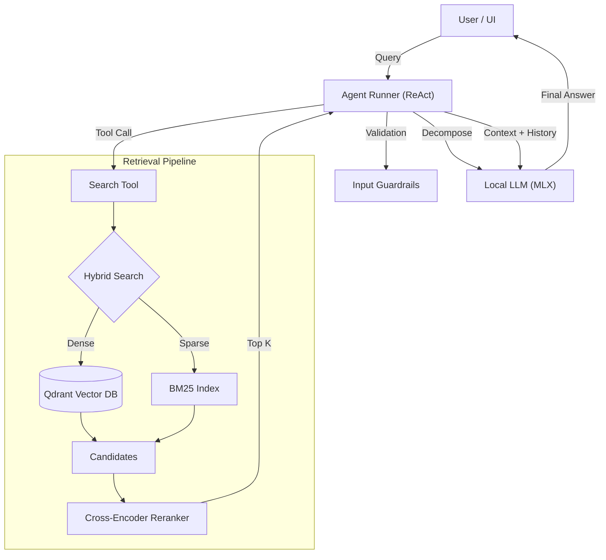

# 🏭 RAG Foundry

> **Agentic RAG Platform** optimized for Local LLMs (Apple Silicon / MLX)


**RAG Foundry** is a production-ready, local-first framework for building advanced Retrieval Augmented Generation (RAG) systems. It evolves beyond simple vector search into an **Agentic System** capable of reasoning, query decomposition, and multi-step retrieval.

## ✨ Key Features

- **🧠 Agentic Reasoning**: Implements a ReAct (Reason+Act) loop allowing the LLM to use tools and decompose complex queries.
- **⚡️ Local Optimization**: Inference powered by **MLX** just-in-time compilation for Apple Silicon, running quantized models (e.g., Qwen2.5-7B-4bit) at high tokens/sec.
- **🔍 Hybrid Retrieval**: Combines Dense Vector Search (**Qdrant**) with Sparse Keyword Search (**BM25**) and Reranking (**Cross-Encoder**) for maximum accuracy.
- **🔭 Full Observability**: Integrated with **Arize Phoenix** for deep tracing of retrieval latentcies, embedding quality, and generation correctness.
- **🧪 Evaluation First**: Built-in regression testing pipeline (`make eval`) using **RAGAS** metrics (Faithfulness, Recall, Precision).
- **🖥️ Streamlit UI**: User-friendly chat interface with side-by-side verification of retrieved contexts.

## 🚀 Quick Start

### Prerequisites
- Docker & Docker Compose
- Python 3.11+
- Apple Silicon Mac (M1/M2/M3) for MLX support

### Installation

1. **Clone the repository**
   ```bash
   git clone https://github.com/kaushikkumarkr/RAG.git
   cd RAG/rag-foundry
   ```

2. **Start the Stack**
   Launch Database (Qdrant), Observability (Phoenix), API, and UI.
   ```bash
   make up
   # Or manually: docker compose up -d
   ```

3. **Start Local Inference Server**
   Since MLX runs natively on the host (not in Docker), start the server separately:
   ```bash
   bash scripts/start_mlx.sh
   # Serves OpenAI-compatible API at http://localhost:8080/v1
   ```

### Usage

**1. Ingest Documents**
Upload PDF/MD/TXT files via the UI (`http://localhost:8501`) or CLI:
```bash
curl -F "file=@./docs/whitepaper.pdf" http://localhost:8000/ingest/file
```

**2. Chat with Agent**
Ask questions that require synthesis:
> "Compare the revenue growth of Company A vs Company B in 2024."

The Agent will:
1.  Decompose the query.
2.  Search for Company A.
3.  Search for Company B.
4.  Synthesize the final answer.

## 🏗️ Architecture



## 🛠️ Development

- **Run Tests**: `make test`
- **Run Eval**: `make eval` (Runs RAGAS metrics on `eval/eval_questions.jsonl`)
- **Lint**: `make lint`

## 📊 Observability

Visit **Phoenix UI** at `http://localhost:6006` to see:
- Traces for every query.
- Latency breakdown (Retrieval vs Generation).
- Retrieved document chunks.

## 📜 License

MIT
