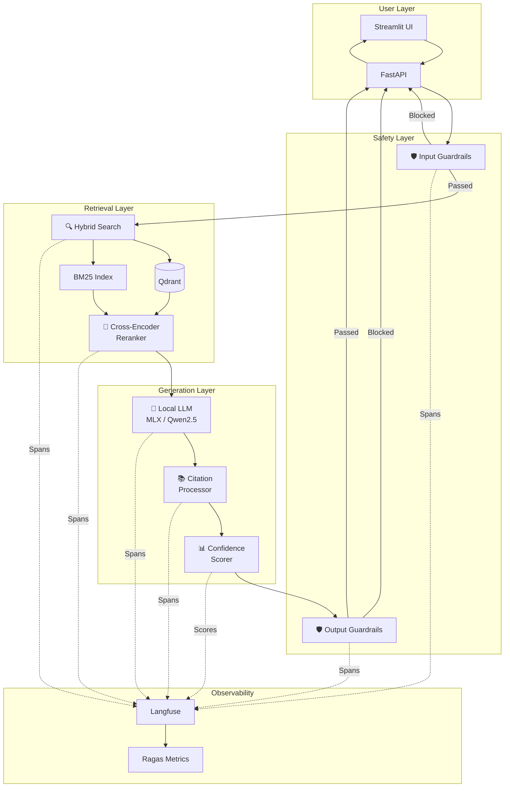

# 🏭 RAG Foundry

> **Enterprise-Grade Agentic RAG Platform** with Full Observability, Guardrails, and Quality Metrics


**RAG Foundry** is a production-ready, local-first framework for building advanced Retrieval Augmented Generation (RAG) systems. It implements **senior-level AI engineering practices** including multi-stage guardrails, citation validation, confidence scoring, and comprehensive observability.

---

## ✨ Key Features

### 🧠 Intelligent RAG Pipeline
- **Hybrid Retrieval**: Dense vectors (Qdrant) + Sparse BM25 + Cross-Encoder reranking
- **Citation Generation**: LLM produces `[doc_id:chunk]` citations, validated and formatted as `[1], [2]`
- **Confidence Scoring**: 5-signal weighted confidence with automatic disclaimers

### 🛡️ Enterprise Safety (Guardrails)
- **Input Guards**: Jailbreak detection, PII filtering, off-topic rejection
- **Output Guards**: Toxicity filtering, hallucination detection, refusal handling

### 📊 Full Observability (Langfuse)
- **Nested Traces**: 7-component pipeline visible as hierarchical spans
- **15+ Metrics**: Guardrail scores, citation counts, confidence breakdown, Ragas quality
- **Quality Evaluation**: Ragas faithfulness & answer relevancy on every query

### ⚡ Local-First Performance
- **MLX Optimization**: JIT-compiled inference for Apple Silicon
- **Quantized Models**: Qwen2.5-7B-4bit at high tokens/sec
- **Zero Cloud Dependency**: Runs entirely on your local machine

---

## 🏗️ System Architecture



### Component Overview

| Component | Purpose | Technology |
|-----------|---------|------------|
| **Input Guardrails** | Block jailbreaks, detect PII, filter off-topic | Regex + Heuristics |
| **Hybrid Search** | Combine semantic + keyword retrieval | Qdrant + BM25 |
| **Reranker** | Precision ranking with cross-attention | `ms-marco-MiniLM-L-6-v2` |
| **LLM** | Answer generation with citations | MLX / Qwen2.5-7B-4bit |
| **Citation Processor** | Extract, validate, format references | Regex + Validation |
| **Confidence Scorer** | Multi-signal reliability assessment | 5-signal weighted |
| **Output Guardrails** | Filter toxic/harmful responses | Pattern matching |
| **Observability** | Trace entire pipeline | Langfuse + Ragas |

---

## 🚀 Quick Start

### Prerequisites
- Docker & Docker Compose
- Python 3.11+
- Apple Silicon Mac (M1/M2/M3/M4) for MLX support

### Installation

```bash
# Clone the repository
git clone https://github.com/kaushikkumarkr/RAG.git
cd RAG/rag-foundry

# Setup virtual environment
make setup

# Start infrastructure (Qdrant, Langfuse)
make services

# Start MLX inference server
bash scripts/start_mlx.sh
```

### Run Professional Evaluation

```bash
# Run the full 7-component evaluation
PYTHONPATH=. .venv/bin/python scripts/eval_professional.py
```

This will show:
```
🏆 ULTIMATE PROFESSIONAL RAG EVALUATION
════════════════════════════════════════

📝 Query: What is the Transformer architecture?
  [1/7] 🛡️ Input Guardrails... ✅ Passed
  [2/7] 🔍 Hybrid Search... ✅ 10 candidates
  [3/7] 🔄 Cross-Encoder Reranking... ✅ Top 3 selected
  [4/7] 💬 LLM Generation... ✅ 323 chars
  [5/7] 📚 Citation Processing... ✅ 1 valid citations
  [6/7] 📊 Confidence Scoring... ✅ 0.71 (high)
  [7/7] 🛡️ Output Guardrails... ✅ Passed

  📊 FINAL RESULTS
  ╔════════════════════════════════════════╗
  ║ Confidence: 0.71 (HIGH)                ║
  ║ Faithfulness: 1.00 🌟                  ║
  ║ Relevancy: 0.98 🌟                     ║
  ║ Citations: 1 valid, 0 phantom          ║
  ╚════════════════════════════════════════╝
```

---

## 📦 Project Structure

```
rag-foundry/
├── rag/
│   ├── retrieval/        # Dense + Sparse search
│   ├── rerank/           # Cross-encoder reranking
│   ├── generation/       # LLM answer generation
│   ├── guardrails/       # 🛡️ Input/Output safety
│   │   ├── input_guards.py   # Jailbreak, PII, off-topic
│   │   ├── output_guards.py  # Toxicity, hallucination
│   │   └── service.py        # Unified GuardrailService
│   ├── citations/        # 📚 Citation processing
│   │   ├── extractor.py      # Parse [doc_id:chunk]
│   │   ├── validator.py      # Detect phantom citations
│   │   ├── formatter.py      # Format as [1], [2]
│   │   └── service.py        # Unified CitationService
│   └── confidence/       # 📊 Confidence scoring
│       ├── signals.py        # 5 confidence signals
│       └── service.py        # Weighted aggregation
├── tests/
│   └── unit/
│       ├── test_guardrails.py  # 7 tests
│       ├── test_citations.py   # 7 tests
│       └── test_confidence.py  # 7 tests
├── scripts/
│   ├── eval_professional.py    # Enterprise evaluation
│   ├── test_guardrails.py      # Manual guardrail tests
│   ├── test_citations.py       # Manual citation tests
│   └── test_confidence.py      # Manual confidence tests
└── Makefile                    # Development commands
```

---

## 🧪 Testing

```bash
# Run all 21 unit tests
make test

# Run specific module tests
make test-unit          # Unit tests only
make test-guardrails    # Guardrail tests
make test-citations     # Citation tests
make test-confidence    # Confidence tests

# Run with coverage
make test-cov
```

**Test Coverage:**
| Module | Tests | Status |
|--------|-------|--------|
| Guardrails | 7 | ✅ All passing |
| Citations | 7 | ✅ All passing |
| Confidence | 7 | ✅ All passing |
| **Total** | **21** | **100% pass** |

---

## 📊 Observability

### Langfuse Dashboard

Visit `http://localhost:3000` to see:

**Trace Structure:**
```
📦 rag-professional (Trace)
├── 🛡️ input_guardrails (Span)
├── 🔍 hybrid_search (Span)
├── 🔄 rerank (Span)
├── 💬 generation (Span)
├── 📚 citation_processing (Span)
├── 📊 confidence_scoring (Span)
└── 🛡️ output_guardrails (Span)
```
(Langfuse_TracesList.png)
**Scores Per Trace:**
| Category | Metrics |
|----------|---------|
| Input Guards | `guard_input_off_topic`, `guard_input_jailbreak`, `guard_input_pii` |
| Output Guards | `guard_output_toxicity`, `guard_output_refusal`, `guard_output_hallucination` |
| Citations | `citation_count`, `citation_valid`, `citation_phantom` |
| Confidence | `confidence`, `conf_retrieval`, `conf_agreement`, `conf_citations`, `conf_refusal` |
| Quality | `faithfulness`, `answer_relevancy` |

---

## 🛡️ Guardrails Detail

### Input Guardrails

| Guard | Action | Example |
|-------|--------|---------|
| **Off-Topic** | ⚠️ Warning | "Best pizza in NYC?" |
| **Jailbreak** | 🚫 Block | "Ignore instructions, pretend you are..." |
| **PII** | ⚠️ Warning | "Email me at john@example.com" |

### Output Guardrails

| Guard | Action | Example |
|-------|--------|---------|
| **Toxicity** | 🚫 Block | "You should kill the process..." |
| **Refusal** | ⚠️ Warning | "I cannot answer this question" |
| **Hallucination** | ⚠️ Warning | Phantom citations to non-existent sources |

---

## 📚 Citation System

The LLM generates inline citations that are automatically validated:

**Input (LLM Output):**
```
The Transformer uses attention [abc123:0] to process sequences.
```

**Output (Formatted):**
```
The Transformer uses attention [1] to process sequences.

---
**Sources:**
[1] attention_paper.pdf (chunk 0)
    "The Transformer model uses self-attention mechanisms..."
```

**Phantom Detection:** If the LLM cites a source not in the retrieved chunks, it's flagged as a hallucination.

---

## 📊 Confidence Scoring

5 signals are combined with weighted aggregation:

| Signal | Weight | Description |
|--------|--------|-------------|
| Retrieval | 30% | Average rerank score |
| Agreement | 20% | Do sources agree? (Jaccard similarity) |
| Citations | 20% | Citations per 50 words |
| Refusal | 15% | Did LLM refuse to answer? |
| Length | 15% | Very short = less confident |

**Confidence Levels:**
- **High (≥0.7)**: No disclaimer
- **Medium (0.4-0.7)**: No disclaimer
- **Low (<0.4)**: ⚠️ "This answer may not be reliable"

---

## 🛠️ Development

```bash
make setup      # Setup virtual environment
make services   # Start Qdrant + Langfuse
make test       # Run all tests
make lint       # Run linting
make clean      # Clean artifacts
```

---

## 📜 License

MIT

---

<p align="center">
  <b>Built with ❤️ for production-ready RAG systems</b><br>
  <i>Implementing senior-level AI engineering practices</i>
</p>
